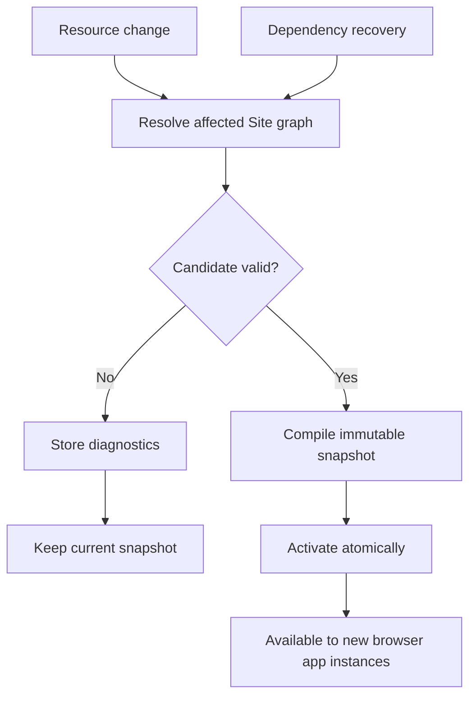
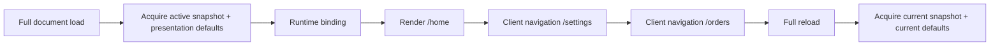
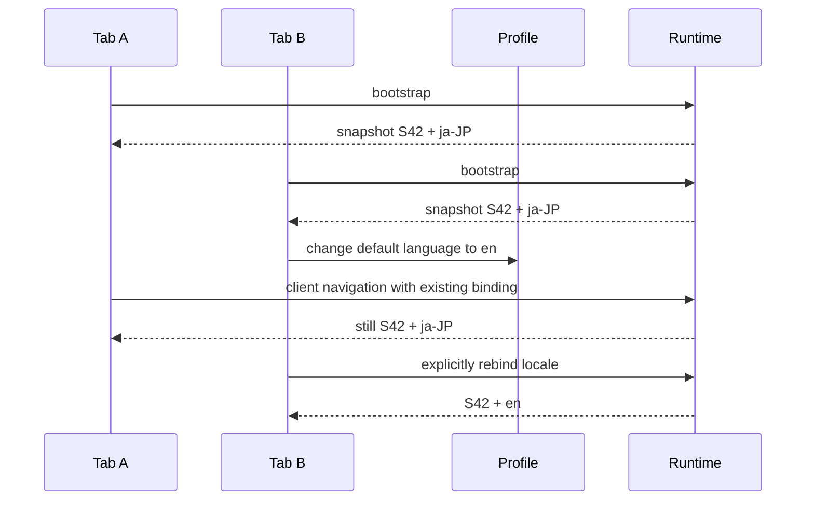
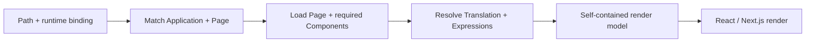

import { Step, Steps } from 'fumadocs-ui/components/steps';

Taskmigo keeps editable authoring state separate from the immutable runtime serving users.

## From save to activation

<Steps>
  <Step>

### Commit authoring state

Saving a Resource creates or reuses an immutable revision and updates that Resource's current authoring pointer. The save can succeed even when the resulting Site cannot activate.

  </Step>
  <Step>

### Resolve and validate the candidate

Taskmigo selects exact revisions for the affected Site graph, validates Resource contracts and cross-Resource rules, and calculates resolved graph checksums. A dependency change can therefore change the Site graph without creating new revisions for unchanged ancestors.

See [Resource model](/versions/v0/manuals/resources#resolved-graph-identity) for the checksum contract.

  </Step>
  <Step>

### Compile and activate

A valid candidate becomes an immutable snapshot containing exact Resource selections and compiled runtime data. Activation swaps the active snapshot atomically. An invalid candidate records diagnostics and leaves the previous snapshot active.

  </Step>
</Steps>

## Browser runtime binding

Activation changes the snapshot used by **new browser application instances**. An already-running tab normally keeps the snapshot it acquired when that application instance was bootstrapped.

The binding belongs to the running application instance, not the login session. Two tabs can therefore use different snapshots without corrupting each other.

### What remains stable?

| Value | During client-side navigation | How it changes |
| --- | --- | --- |
| Site snapshot | Pinned to the binding. | Normally on full reload; future expiry/revocation may require reload. |
| Locale | Pinned presentation context. | Explicit change in that tab or a new bootstrap. |
| Future presentation values | Pinned only when the contract explicitly classifies them as presentation context. | Defined by that presentation feature. |
| Authorization and business state | Not automatically pinned. | Follows the freshness rules of the owning capability. |

Snapshot pinning is a UI/runtime-consistency rule, not permission caching.

## Why locale is part of the binding

The profile language is a default used during bootstrap or an explicit presentation change. It is not reread as the locale for every navigation. `Trans` and `TransN` therefore cannot switch one Page to a different language while the existing layout remains in the old language.

## Rendering behavior

For one render/navigation operation, Taskmigo resolves the route, Page, reusable Components, Translation values, and backend Expressions from the snapshot and presentation context carried by the binding.

The frontend does not parse manifests, traverse imports, select revisions, or evaluate Expressions. The target serving contract is one backend round trip for the happy-path render; the concrete endpoint and binding token format remain open decisions. Implementation details belong in [Resource and runtime](/versions/v0/developer/resource-runtime) and [API development](/versions/v0/developer/api#ssr-serving-contract).

## Dependency recovery

Restoring or changing a dependency reevaluates affected Sites through the same candidate pipeline. Recovery does not create revisions for unchanged importers: resolved graph identity propagates the dependency change instead.

Intermediate authoring revisions are not guaranteed to become active, and recovery has no fixed completion time.

## Package import

A package import is validated as one candidate before activation. A failed import cannot partially replace runtime state. Revision IDs, resolved selections, graph checksums, and revision tags are runtime/authoring metadata and are not imported as manifest source.

## Workflow execution

<Callout title='Workflow is an RFC and is not implemented' type='warning'>
  The behavior below belongs to the Workflow RFC and does not describe an available runtime capability.
</Callout>

A proposed Workflow execution pins the Site snapshot, Workflow revision, and selected dependencies when execution starts. Newer snapshots would affect new executions only. See [Workflow — execution and revision pinning](/versions/v0/manuals/manifests/v0-workflow#execution-and-revision-pinning).
