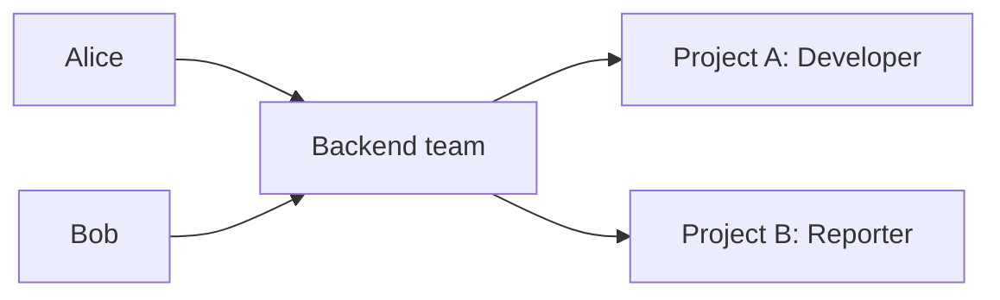

## Users

A user represents one person in a Taskmigo installation. Project permissions are not stored on the user.

| Field                | Contract                                                                  |
| -------------------- | ------------------------------------------------------------------------- |
| ID                   | Stable internal identifier.                                               |
| Username             | Unique login/display handle within the installation.                      |
| Email                | Unique normalized email address.                                          |
| Display name         | Human-readable name shown in the UI.                                      |
| Status               | `ACTIVE`, `SUSPENDED`, or `DISABLED`.                                     |
| System administrator | Installation-level administrative privilege, separate from project roles. |

`SUSPENDED` prevents authentication while preserving membership and audit history. `DISABLED` represents an account that is no longer intended for use. Neither state deletes historical authorship.

Authentication providers are deliberately outside this domain contract. Password, OIDC, LDAP, or SAML integration may map to the same User resource without changing project authorization.

## Groups

A group is a reusable set of users. Groups are useful when the same team participates in several projects.

A user's effective project access changes immediately when their group membership changes.

Nested groups are not supported. A group contains users only. This avoids cycles and keeps effective membership explainable in both the API and UI.

Deleting a group must not delete its users. It removes the group's project memberships and therefore removes access that was inherited only through that group.
