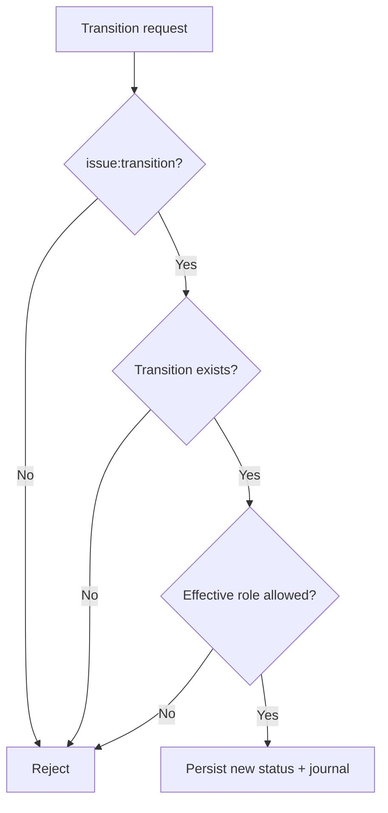

A workflow controls how an issue moves between statuses. The workflow is evaluated in addition to normal authorization.

## Workflow scope

A project selects one workflow for each enabled issue type. A workflow contains a set of transitions:

| Field | Contract |
| --- | --- |
| From status | Current status required for the transition. |
| To status | Resulting status. |
| Allowed roles | Project roles that may perform the transition. |

A transition from a status to itself is not a transition and is rejected.

## Decision process

To change an issue from `Open` to `In Progress`, Taskmigo evaluates all of the following:

1. The project is active.
2. The actor can access the project.
3. The actor has `issue:transition` through at least one effective role.
4. The issue type's selected workflow contains the requested `Open -> In Progress` transition.
5. At least one of the actor's effective roles appears in that transition's allowed roles.

## Workflow changes

Editing a workflow affects future transition decisions immediately. It does not rewrite the status or history of existing issues.

A status that is currently referenced by an issue or workflow cannot be deleted. Administrators should retire it from active workflows first; a separate archival model for configuration values can be introduced when lifecycle needs justify it.

## Example

For a Bug workflow:

| From | To | Roles |
| --- | --- | --- |
| New | In Progress | Developer, Manager |
| In Progress | Resolved | Developer, Manager |
| Resolved | Closed | Manager |
| Resolved | In Progress | Developer, Manager |

This model supports different lifecycle rules for different kinds of work without embedding status logic inside the Role resource.
