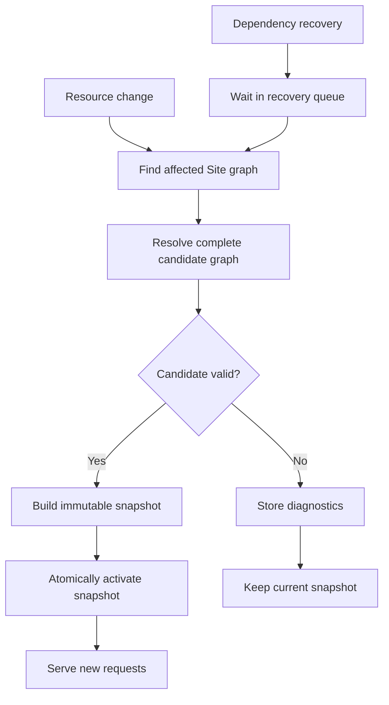
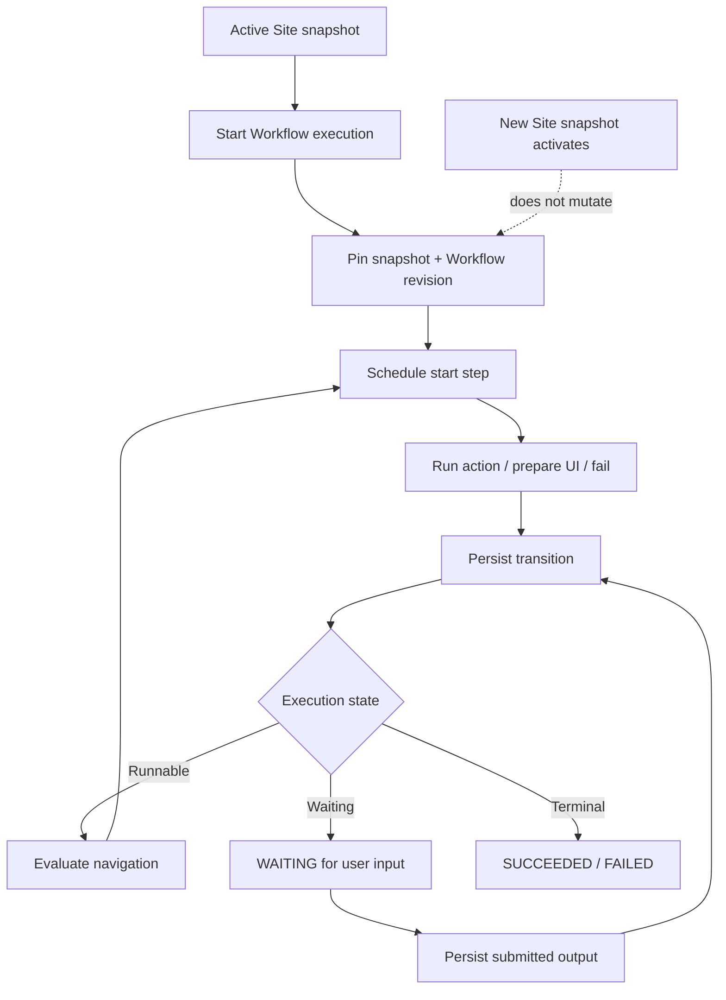

import { Step, Steps } from 'fumadocs-ui/components/steps';

Taskmigo never activates a manifest directly. Every change produces a candidate Site graph. Only a complete, valid candidate can become the current immutable snapshot.

## Complete lifecycle

Create, update, delete, restore, and package import all enter this lifecycle. Dependency recovery rejoins the same flow after its queued work begins.

The active Site is never replaced by a partial or invalid candidate. A failed candidate ends at diagnostics; a valid candidate becomes visible only after the atomic activation step.

## How a candidate moves through the lifecycle

<Steps>
  <Step>

### Find the affected graph

Taskmigo starts with the changed resource and follows reverse `imports` references to the Site. Resources outside the reachable graph are not revalidated.

Translation catalogs are tracked by effective locale rather than explicit reference edges. Changing a translation resource also affects a Site graph that uses that locale.

  </Step>
  <Step>

### Resolve the complete candidate

Taskmigo resolves the `v0/site` from its current declarations and selects a revision for every import edge. It attaches the translation catalog for the effective locale.

Separate graph branches may select different versions of the same `(kind, name)`, and both revisions may coexist in one candidate. Resolution never rewrites manifests, substitutes a dependency, or falls back to an older revision. See [Resource model](/versions/v0/resources#imports) for reference and version selection rules.

  </Step>
  <Step>

### Validate the complete candidate

Taskmigo checks YAML and common metadata, kind-specific schemas, dependency resolution, graph rules, and security constraints. Dependencies must be valid before their importers can be valid, but the internal validator call order is not part of the public API.

  </Step>
  <Step>

### Build an immutable snapshot

A valid candidate is compiled into one Site snapshot containing every selected resource revision and the normalized runtime model. Later resource changes cannot alter that snapshot.

  </Step>
  <Step>

### Activate atomically

Taskmigo stores the replacement and atomically makes it current in PostgreSQL. New requests read the replacement. Requests already in progress may finish on the snapshot they started with. There is no separate publish step or manual activation state.

  </Step>
</Steps>

## Validation outcome

| Outcome              | Runtime result                                                           |
| -------------------- | ------------------------------------------------------------------------ |
| Candidate is valid   | Build and atomically activate a new snapshot.                            |
| Candidate is invalid | Store structured diagnostics and continue serving the current snapshot. |

Diagnostics identify the error, manifest path, and source location when available. They must not expose credentials, connection strings, or data from schemas that Taskmigo does not own.

## Dependency recovery

When a dependency becomes missing, invalid, or valid again, Taskmigo queues every affected Site graph for reevaluation. Recovery candidates run one at a time in queue order. A candidate must activate or fail before the next begins, which prevents conflicting snapshot activations.

When its turn begins, recovery follows the same lifecycle shown above: re-resolve the complete graph, validate it, then either activate one new snapshot or retain the current snapshot with updated diagnostics. Queue order coordinates processing; it does not guarantee that every intermediate resource revision becomes active or that recovery completes within a maximum time.

Recovery does not repair invalid manifests or expose the internal queue implementation.

## Package boundary

Package import enters the lifecycle as one change. Taskmigo validates the complete package, including the one-Site invariant and reference hierarchy, before resolving dependencies inside its PostgreSQL schema. A failed import cannot leave a partially active runtime state.

Export produces portable canonical YAML. Importing it still runs the lifecycle above; exported resolution results are not trusted as runtime state.

## Workflow execution lifecycle (RFC)

<Callout title='RFC runtime' type='warn'>
  This lifecycle is proposed by the [`v0/workflow` RFC](/versions/v0/manifests/v0-workflow). It extends the snapshot lifecycle above; it does not replace or change the currently defined activation contract.
</Callout>

A Workflow definition is compiled into a Site snapshot like any other reachable resource. An execution is different: it is durable state created from one already-active snapshot and must keep using that exact definition until it reaches a terminal state.

Every meaningful transition is persisted before dependent work is scheduled. Waiting for user input does not hold an HTTP request or worker open, and a service restart resumes from persisted state.

Snapshot activation and Workflow execution therefore have separate effects:

| Event | Existing Workflow execution | New Workflow execution |
| --- | --- | --- |
| A newer Workflow revision activates | Continues on its pinned revision | Uses the revision selected by the current snapshot |
| An imported Component changes | Continues with the pinned dependency | Uses the dependency selected by the current snapshot |
| A candidate snapshot is invalid | Continues unchanged | Starts from the still-current valid snapshot |
| Service restarts | Resumes from persisted execution state | Starts normally after runtime recovery |

The RFC execution states are `PENDING`, `RUNNING`, `WAITING`, `SUCCEEDED`, and `FAILED`. Cancellation and manual pause are outside its initial scope. Retry attempts, timeouts, step outputs, and UI interaction state are execution history; they are not Site snapshot revisions.
