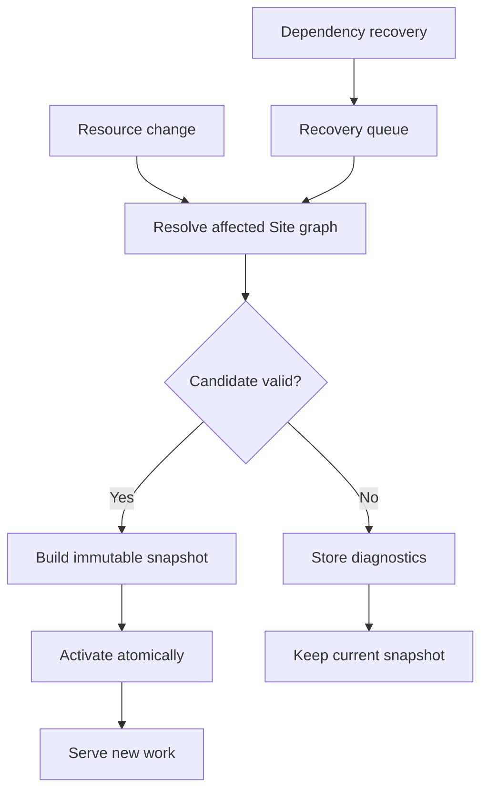
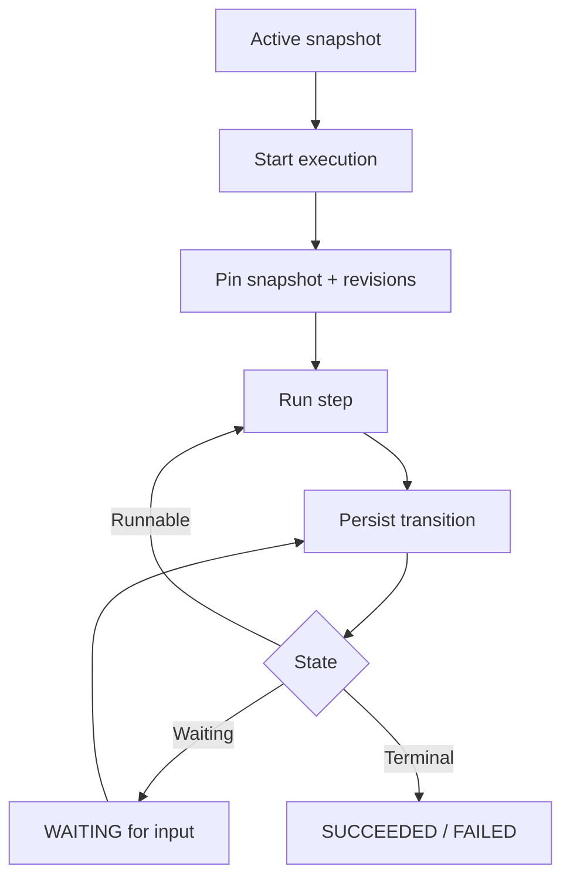

import { Step, Steps } from 'fumadocs-ui/components/steps';

## Resource change lifecycle

Create, update, delete, restore, package import, and dependency recovery all use this lifecycle.

<Steps>
  <Step>

### Resolve the affected Site

Taskmigo resolves a complete candidate graph. Translation changes also affect Sites using the corresponding locale catalog. Under the Policy RFC, Policy revisions and Role attachments affect Sites that pin them. See [Resource resolution](/versions/v0/resources#resolution).

  </Step>
  <Step>

### Validate the candidate

Each revision is validated against its `apiVersion` and `kind`, followed by dependency, graph, and security checks. Invalid candidates store diagnostics and leave the active snapshot unchanged.

  </Step>
  <Step>

### Build and activate

A valid candidate becomes an immutable snapshot containing the selected revisions and normalized runtime model, then replaces the active snapshot atomically.

  </Step>
</Steps>

Diagnostics identify the error, manifest path, and source location when available without exposing credentials or data outside Taskmigo's schema.

## Workflow execution

Transitions are persisted before dependent work is scheduled. Service restarts resume from persisted state, and waiting for input does not hold an HTTP request or worker.

Existing executions keep their pinned Workflow and dependencies; newer snapshots affect new executions only. See [Workflow RFC](/versions/v0/manifests/v0-workflow#execution-and-revision-pinning) for step behavior.

## Dependency recovery

Dependency changes queue affected Sites for reevaluation. Candidates run one at a time through the lifecycle above, preventing conflicting activations. Intermediate revisions are not guaranteed to activate, and recovery has no fixed completion time.

## Package import

A package is validated as one candidate before activation. A failed import cannot partially change runtime state. Exported revision IDs, resolution results, and revision tags are not imported as manifest state.
